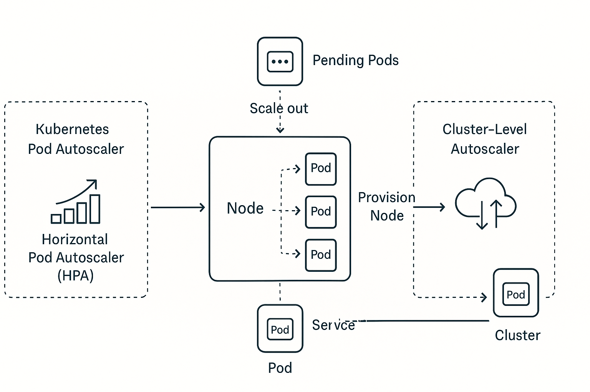

# Kubernetes Pod and Container Architecture

This document provides a high-level overview of how Kubernetes orchestrates containers using **Pods** as the fundamental unit of deployment. The included diagram illustrates the internal structure and logic of a Pod, which remains consistent across various deployment environments:

## 📌 Supported Environments

- ✅ **Cloud-managed clusters** — such as GKE (Google Kubernetes Engine), EKS (AWS), and AKS (Azure)
- ✅ **Self-hosted Kubernetes** — installed directly on VPS, virtual machines, or bare metal servers
- ✅ **Local development** — via tools like Minikube or `kind`, allowing developers to simulate Kubernetes behavior locally

---

## 🧩 What is a Pod?

A **Pod** is the smallest deployable unit in Kubernetes. It can contain one or more tightly coupled containers that:

- Share the same **network namespace** (including IP address and port space)
- Share the same **volumes** (for storage and secrets)
- Are scheduled together on the same **node**
- Are restarted together if the Pod crashes or is recreated

---

## 🖼 Diagram

The following schematic shows a typical Kubernetes Pod and its relation to the containers inside it:

---

## 💡 Key Takeaways

- Each **Pod** can host multiple containers, but most Pods in practice host **a single container** for simplicity and scalability.
- All containers inside a Pod can communicate with each other via `localhost`.
- Pods are ephemeral — if one fails, Kubernetes may destroy and recreate it with a new IP.
- Pods are scheduled and managed by higher-level Kubernetes objects such as **Deployments**, **ReplicaSets**, and **Jobs**.

---

## 🧪 Why Use Minikube?

Minikube is a great tool for **local Kubernetes development**. It allows developers to:

- Test Kubernetes configurations without deploying to the cloud
- Learn Kubernetes concepts with hands-on experience
- Use familiar Docker images and tools in a local environment
- Simulate production-like behavior including service exposure, scaling, and logging

---

## ✅ Good First Step for Developers

Even if you're primarily a backend or frontend developer, understanding how your app runs in Kubernetes can help you:

- Design better containerized apps
- Collaborate more effectively with DevOps/SRE teams
- Own the full lifecycle of your service: from code to deployment

---

🛠 Happy hacking with Minikube and Kubernetes!

Connect with me on [LinkedIN](https://www.linkedin.com/in/whatafunc/)
Get back to main Golang [app overview](https://github.com/whatafunc/port-service-golang/tree/v0.1)